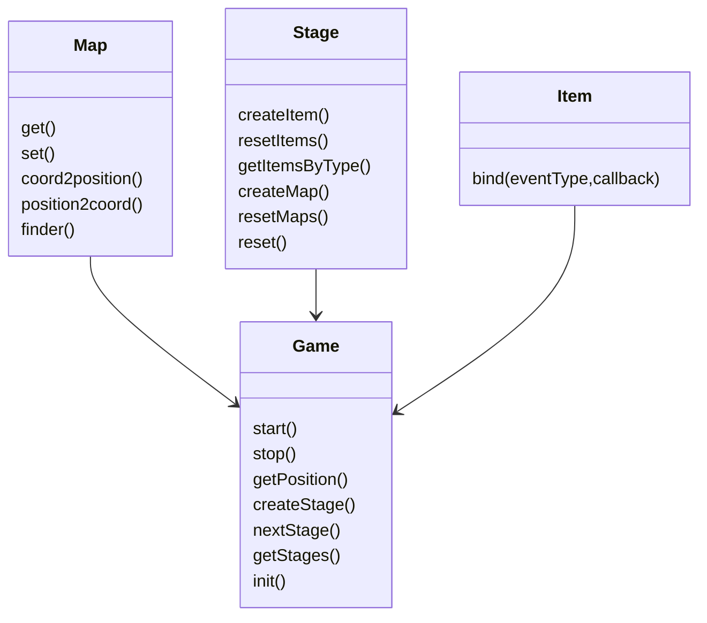
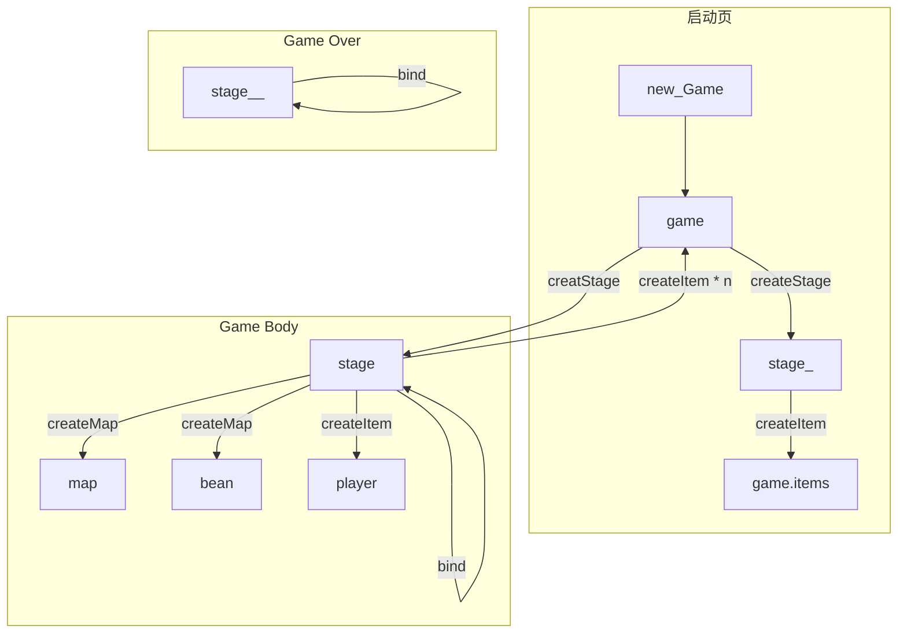

### 目的

学学js, 主要是js的OOP这一块.

### 版权

本游戏由 [passer-by.com](https://passer-by.com/) 制作，请尊重作者，引用请注明来源。

### 总体结构

```mermaid
classDiagram
Map --> Game
Stage --> Game
Item --> Game

Game : start()
Game : stop()
Game : getPosition()
Game : createStage()
Game : nextStage()
Game : getStages()
Game : init()
Item : bind(eventType,callback)
Map : get()
Map : set()
Map : coord2position()
Map : position2coord()
Map : finder()
Stage : createItem()
Stage : resetItems()
Stage : getItemsByType()
Stage : createMap()
Stage : resetMaps()
Stage : reset()
```

### 总体流程

```mermaid
flowchart TB

subgraph 启动页
new_Game --> game
game -->|createStage| stage_
stage_ -->|createItem| game.items
end

subgraph Game Body
game -->|creatStage| stage
stage -->|createMap| map
stage -->|createMap| bean
stage -->|createItem * n| game
stage -->|createItem| player
stage -->|bind| stage
end

subgraph Game Over
stage__ -->|createItem| stage__
stage__ -->|bind| stage__
end
```

### TD

- [x] 理清楚关系
- [ ] 建立框架